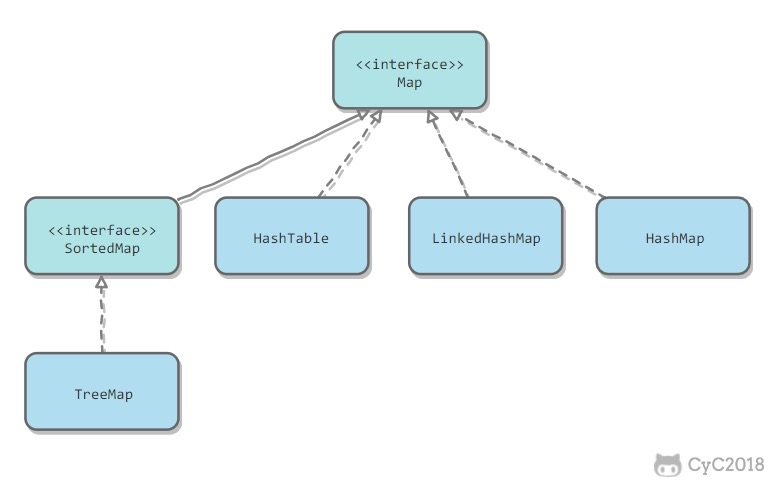

# Map
#1. Java基础/容器#

* **TreeMap**：基于 _红黑树_ 实现。 
* **HashMap**：基于 _哈希表_ 实现。使用拉链法， _桶内链表的长度超过8换为红黑树（JDK1.8开始）_ 。
* **HashTable**：和HashMap类似，但它是线程安全的，这意味着同一时刻多个线程可以同时写入 HashTable 并且不会导致数据不一致。它是遗留类，不应该去使用它。现在可以使用ConcurrentHashMap 来支持线程安全，并且ConcurrentHashMap的效率会更高，因为ConcurrentHashMap 引入了分段锁。 
* **LinkedHashMap**：继承自 _HashMap_ ，同样具有快速查找的特性，使用双向链表来维护元素的顺序，顺序为插入顺序或者最近最少使用（LRU）顺序。桶内链表过长时转换为 _红黑树_ 。
